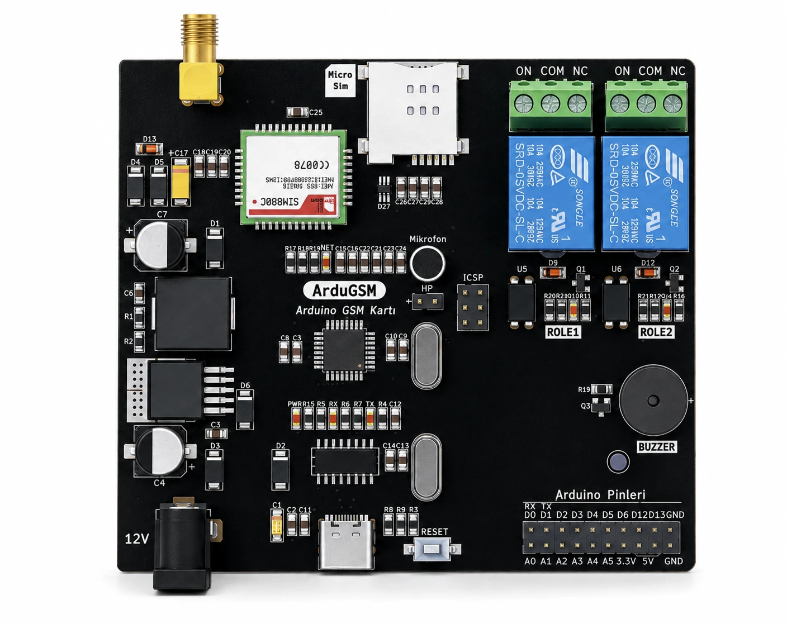
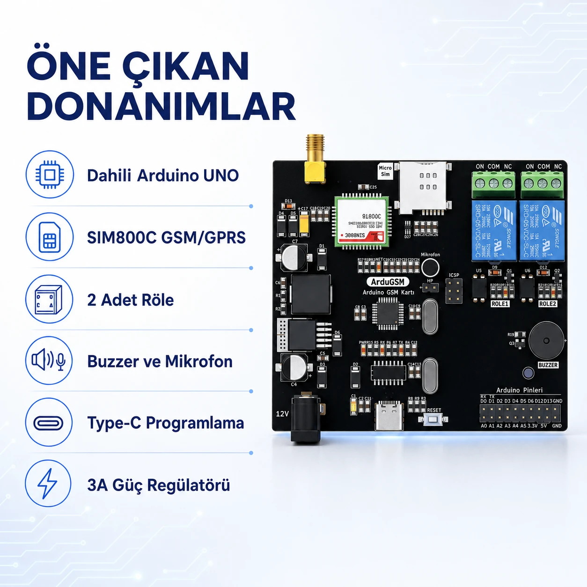
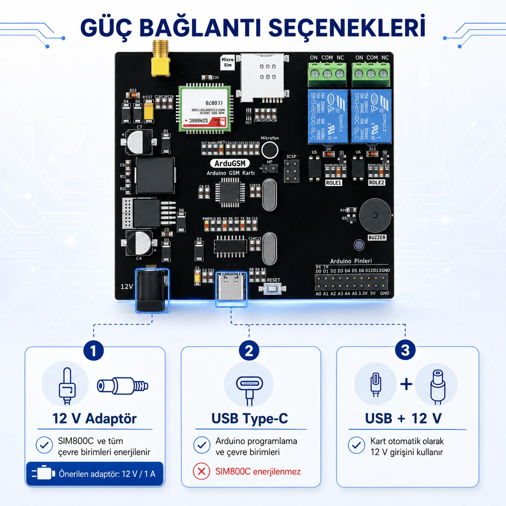
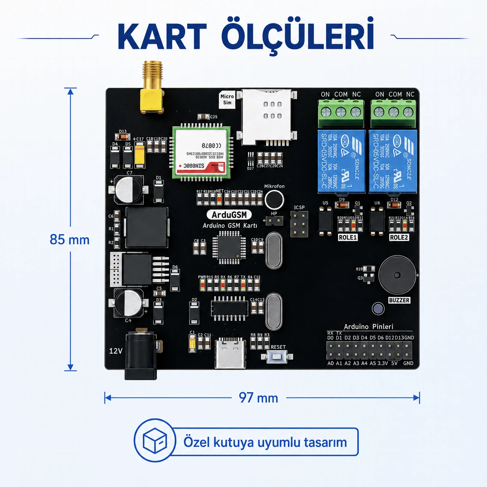

# ArduGSM — Arduino ve SIM800C GSM Kontrol Kartı

[English](README.en.md) · [Ürün sayfası](https://ilimera.com/urunler/gelistirme-kartlari/ardugsm) · [Teknik doküman (PDF)](docs/ArduGSM_teknik_dokuman_v1.pdf)



ArduGSM; **Arduino UNO (ATmega328P)**, **SIM800C GSM/GPRS** modülü, **2 röle**, **buzzer**, mikrofon/hoparlör
bağlantısı ve **3 A güç katını** tek kartta birleştirir. Harici Arduino, shield veya ek kablo gerekmez;
Arduino IDE ile USB Type-C üzerinden programlanır. SMS, sesli arama ve GPRS ile uzaktan kontrol ve izleme
projeleri için tasarlanmıştır.

Bu depo kartla hemen çalışmaya başlamanız için örnek kodları ve AT komut başvurusunu içerir.

## İçindekiler

- [Teknik özellikler](#teknik-özellikler)
- [Sabit pin bağlantıları](#sabit-pin-bağlantıları)
- [Güç](#güç)
- [Hızlı başlangıç](#hızlı-başlangıç)
- [Örnekler](#örnekler)
- [AT komutları](docs/AT_KOMUTLARI.md)
- [Sık karşılaşılan sorunlar](#sık-karşılaşılan-sorunlar)
- [Destek](#destek)

## Teknik özellikler

| Özellik | Değer |
| --- | --- |
| Mikrodenetleyici | ATmega328P (Arduino UNO mimarisi) |
| Hücresel modül | SIM800C, dört bant **2G GSM/GPRS** |
| SIM | Micro SIM, TVS diyot ESD koruması |
| Anten | SMA konnektör (harici anten) |
| Röle çıkışları | 2 adet bağımsız röle (ON / COM / NC klemens) |
| Sesli uyarı | Kart üstü buzzer |
| Ses | Dahili mikrofon, hoparlör (HP) bağlantısı |
| Programlama | USB Type-C, Arduino IDE / PlatformIO |
| Güç | 12 V / 1 A DC adaptör, 3 A buck regülatör, ters polarite koruması |
| Boyut | 97 × 85 mm |



## Sabit pin bağlantıları

Kart üstündeki bileşenler ATmega328P'nin şu pinlerine sabit bağlıdır; kodunuzda bu pinleri başka işler için
kullanmayın.

| Arduino pini | Bağlı olduğu yer | Kullanım |
| --- | --- | --- |
| D7 | Buzzer | `HIGH` → ses verir |
| D8 | Röle 1 | `HIGH` → röle çeker |
| D9 | Röle 2 | `HIGH` → röle çeker |
| D10 | SIM800C TX | `SoftwareSerial` **RX** |
| D11 | SIM800C RX | `SoftwareSerial` **TX** |

```cpp
#include <SoftwareSerial.h>
SoftwareSerial gsm(10, 11);   // RX = D10 (SIM800C TX), TX = D11 (SIM800C RX)
```

Kenardaki **Arduino Pinleri** konnektöründe sensörleriniz için D0–D6, D12, D13, A0–A5, 3.3 V, 5 V ve GND
kullanılabilir. D0/D1 USB seri hattıyla ortaktır.

Röle klemensleri: **COM** ortak uç, **ON** röle çektiğinde COM'a bağlanan uç (normalde açık), **NC** röle
çekmediğinde COM'a bağlı uç (normalde kapalı).

## Güç



| Bağlantı | Ne çalışır |
| --- | --- |
| Yalnız USB Type-C | Arduino programlama ve çevre birimleri. **SIM800C ve röleler çalışmaz.** |
| 12 V adaptör | SIM800C ve tüm çevre birimleri |
| USB + 12 V | Kart 12 V girişini kullanır; programlarken GSM de çalışır |

SIM800C şebekeye kayıt olurken ve veri gönderirken anlık **2 A**'e kadar akım çeker. SMS, arama, GPRS ve röle
testleri için **12 V / 1 A** adaptör mutlaka takılı olmalıdır.

## Hızlı başlangıç

1. SMA anteni ve Micro SIM'i takın, kartı 12 V adaptörle besleyin.
2. USB Type-C kablosuyla bilgisayara bağlayın.
3. Arduino IDE'de **Araçlar → Kart: Arduino Uno** ve kartın portunu seçin.
4. [`examples/01_AT_Komut_Terminali`](examples/01_AT_Komut_Terminali) örneğini yükleyin.
5. Seri Monitörü **115200 baud, Both NL & CR** ile açın, `AT` yazın → `OK`.
6. `AT+CPIN?` → `READY`, `AT+CSQ` → 10 ve üzeri, `AT+CREG?` → `0,1` ise kart şebekeye hazırdır.

PlatformIO kullanıyorsanız ortam: `board = uno`, `framework = arduino`.

## Örnekler

| Örnek | Ne yapar |
| --- | --- |
| [01_AT_Komut_Terminali](examples/01_AT_Komut_Terminali) | Seri Monitörden SIM800C'ye doğrudan AT komutu gönderin |
| [02_Role_ve_Buzzer_Testi](examples/02_Role_ve_Buzzer_Testi) | İki röleyi ve buzzer'ı sırayla çalıştırır (GSM gerekmez) |
| [03_SMS_Gonder](examples/03_SMS_Gonder) | Modemi hazırlar ve bir numaraya SMS gönderir |
| [04_SMS_ile_Role_Kontrolu](examples/04_SMS_ile_Role_Kontrolu) | Yetkili numaralardan gelen SMS'le röleleri açar/kapatır, durumu SMS ile bildirir |
| [05_Arama_ile_Role_Tetikleme](examples/05_Arama_ile_Role_Tetikleme) | Yetkili numara arayınca aramayı ücretsiz reddeder ve Röle 1'i tetikler (kapı/bariyer) |
| [06_GPRS_HTTP_GET](examples/06_GPRS_HTTP_GET) | GPRS'e bağlanır ve bir adrese HTTP GET isteği atar |

Örneklerin başındaki **KULLANICI AYARLARI** bölümünde numara, APN gibi değerleri kendinize göre değiştirin.
Hepsi Arduino UNO için derlenmiştir ve ek kütüphane gerektirmez (`SoftwareSerial` Arduino ile gelir).

## Sık karşılaşılan sorunlar

| Belirti | Çözüm |
| --- | --- |
| `AT`'ye cevap yok | 12 V adaptörü takın; SIM800C yalnız USB ile çalışmaz |
| Röleler çekmiyor | Aynı sebep: röleler 12 V beslemeden enerji alır |
| `+CREG: 0,2` (aranıyor) uzun sürüyor | Anteni kontrol edin; bölgenizde ve operatörünüzde 2G olduğundan emin olun |
| `+CPIN: SIM PIN` | SIM'in PIN kodunu telefonda kapatın ya da `AT+CPIN="1234"` gönderin |
| Modem kendiliğinden yeniden başlıyor | Adaptör yetersiz: en az 12 V / 1 A kullanın |
| GPRS açılmıyor | APN'i operatörünüze göre ayarlayın, SIM'de veri paketi olduğunu kontrol edin |

Daha fazlası: [AT komut başvurusu](docs/AT_KOMUTLARI.md).



## Destek

Teknik doküman, güncellemeler ve destek için [ilimera.com](https://ilimera.com/urunler/gelistirme-kartlari/ardugsm).
Bir hata bulduysanız ya da öneriniz varsa bu depoda **Issue** açabilirsiniz.

ArduGSM, İLİMERA Teknoloji tarafından geliştirilmiştir.

## Lisans

Örnek kodlar [MIT lisansı](LICENSE) ile sunulur; kendi ürünlerinizde serbestçe kullanabilirsiniz.
Teknik dokümanlar ve görseller İLİMERA Teknoloji'ye aittir.
